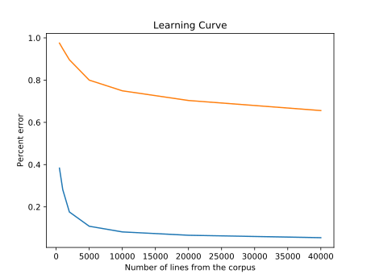

# ECS 189G Part of speech tagging

## Task 1

In this task, the file I used to train ([ptb.22.txt](./ptb.22.txt)) contains 1700 lines. Hence I chose breakpoints to be 50, 100, 200, 500, 1000, 1500, 1700. The plot of errors vs. training size is seen as follows:

The results are not very surprising. My assumption is that the larger the corpus is used for training, the less percent error will be occuring; it is verified by the plot. Moreover, as the data set gets bigger, the errors decline more and more slowly, so this means that at certain size of training corpus, the benefits of trying larger training sizes would be negligible.

